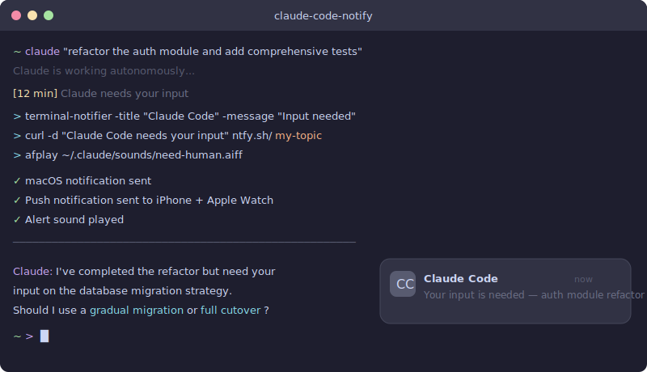

<div align="center">

# Claude Code Notify

**Get notified on your Mac, iPhone, and Apple Watch when Claude Code needs your input.**

[](LICENSE)
[](https://support.apple.com/macos)
[](https://docs.anthropic.com/en/docs/claude-code)
[](https://ntfy.sh)

<br />

When running Claude Code in autonomous mode, tasks can take minutes to complete.<br />
Instead of staring at the terminal, get pinged the moment Claude needs a decision.

<br />



<br />

**Mac** &nbsp;·&nbsp; **iPhone** &nbsp;·&nbsp; **Apple Watch** &nbsp;·&nbsp; **Android**

</div>

<br />

## The Problem

You kick off Claude Code on a big task, and it runs autonomously for 5–15 minutes. You walk away to grab coffee, check your phone, or context-switch to something else. When you come back, Claude has been waiting for your input for the past 10 minutes. Time wasted.

## The Solution

This project sets up **three independent notification channels** so you never miss a prompt:

```
Claude Code needs your input
  │
  ├──→ terminal-notifier  →  macOS Notification Center  →  Mac banner + sound
  │
  ├──→ ntfy.sh (HTTP POST) →  ntfy server  →  ntfy app  →  iPhone / Apple Watch
  │
  └──→ Claude Code hook    →  plays custom alert sound via afplay
```

| Channel | Reaches | Latency | Requires |
|---------|---------|---------|----------|
| `terminal-notifier` | Mac | Instant | macOS |
| `ntfy.sh` | iPhone + Apple Watch + Android | ~1-3s | ntfy app |
| Hook sound (`afplay`) | Mac speakers | Instant | Audio file |

---

## Table of Contents

- [Quick Start](#quick-start)
- [Manual Setup](#manual-setup)
  - [1. Install terminal-notifier](#step-1-install-terminal-notifier)
  - [2. Set Up ntfy.sh](#step-2-set-up-ntfysh)
  - [3. Configure CLAUDE.md](#step-3-configure-claude-code-claudemd)
  - [4. Add Sound Hooks](#step-4-add-sound-hooks-optional)
  - [5. Grant Permissions](#step-5-grant-permissions)
- [Configuration Reference](#full-configuration-reference)
- [Security Notes](#security-notes)
- [Self-Hosting ntfy](#self-hosting-ntfy-optional)
- [Troubleshooting](#troubleshooting)
- [Related Projects](#related)

---

## Prerequisites

- macOS (Apple Silicon or Intel)
- [Homebrew](https://brew.sh/)
- [Claude Code CLI](https://docs.anthropic.com/en/docs/claude-code) installed
- iPhone with [ntfy app](https://apps.apple.com/app/ntfy/id1625396347) or Android with [ntfy app](https://play.google.com/store/apps/details?id=io.heckel.ntfy) (optional but recommended)
- Apple Watch paired with iPhone (optional — notifications mirror automatically)

## Quick Start

```bash
# 1. Clone the repo
git clone https://github.com/mingrath/claude-code-notify.git
cd claude-code-notify

# 2. Run the setup script
chmod +x setup.sh
./setup.sh

# 3. Follow the prompts to configure your ntfy topic name
```

The setup script will:
- Install `terminal-notifier` and `ntfy` via Homebrew
- Generate a unique topic name for you
- Set up notification sound files
- Output ready-to-paste config snippets

Or follow the [manual setup](#manual-setup) below.

---

## Manual Setup

### Step 1: Install terminal-notifier

```bash
brew install terminal-notifier
```

Verify it works:

```bash
terminal-notifier -title "Test" -message "Hello from terminal!" -sound default
```

You should see a macOS notification banner.

### Step 2: Set Up ntfy.sh

[ntfy.sh](https://ntfy.sh) is a free, open-source push notification service. No account required.

**Install the CLI (optional, for testing):**

```bash
brew install ntfy
```

**Choose a unique topic name:**

Your topic name acts like a private channel. Pick something unique and hard to guess:

```bash
# Good — includes your name + random suffix
MY_TOPIC="yourname-claude-notify-x7k2"

# Bad — too generic, anyone could subscribe
MY_TOPIC="claude-notifications"
```

**Test it:**

```bash
# Terminal 1: Subscribe (or just open the topic in the ntfy app)
ntfy subscribe $MY_TOPIC

# Terminal 2: Send a test message
curl -d "Hello from Claude Code!" ntfy.sh/$MY_TOPIC
```

**Install the ntfy app on your phone:**

1. Install [ntfy for iOS](https://apps.apple.com/app/ntfy/id1625396347) or [ntfy for Android](https://play.google.com/store/apps/details?id=io.heckel.ntfy)
2. Open the app and tap **+** to subscribe
3. Enter your topic name (e.g., `yourname-claude-notify-x7k2`)
4. Enable notifications when prompted
5. If you have an Apple Watch, notifications will automatically mirror from iPhone

### Step 3: Configure Claude Code CLAUDE.md

Add this to your global `~/.claude/CLAUDE.md`:

````markdown
## Notifications

Whenever you need my decision or input, notify me via terminal-notifier before asking. If ntfy is available (Apple Watch), also send to ntfy.

```bash
terminal-notifier -title "Claude Code" -message "Your input is needed" -sound default && curl -s -d "Claude Code needs your input" ntfy.sh/YOUR_TOPIC_NAME > /dev/null 2>&1
```
````

> **Note:** Replace `YOUR_TOPIC_NAME` with your chosen ntfy topic.

This tells Claude to run the notification command every time it needs your input.

### Step 4: Add Sound Hooks (Optional)

Claude Code supports [hooks](https://docs.anthropic.com/en/docs/claude-code/hooks) — shell commands that fire on specific events. Add audio cues so you hear when Claude needs you or finishes a task.

**Prepare sound files:**

```bash
mkdir -p ~/.claude/sounds

# Use macOS built-in sounds, or add your own .mp3/.wav files
cp /System/Library/Sounds/Ping.aiff ~/.claude/sounds/need-human.aiff
cp /System/Library/Sounds/Glass.aiff ~/.claude/sounds/finish.aiff
```

**Add hooks to `~/.claude/settings.json`:**

```json
{
  "hooks": {
    "Notification": [
      {
        "matcher": "",
        "hooks": [
          {
            "type": "command",
            "command": "afplay -v 0.3 '$HOME/.claude/sounds/need-human.aiff'"
          }
        ]
      }
    ],
    "Stop": [
      {
        "matcher": "",
        "hooks": [
          {
            "type": "command",
            "command": "afplay -v 0.3 '$HOME/.claude/sounds/finish.aiff'"
          }
        ]
      }
    ]
  }
}
```

| Hook | Fires When | Purpose |
|------|------------|---------|
| `Notification` | Claude needs your input | Alert sound so you look at the terminal |
| `Stop` | Claude finishes a task | Completion chime |

> `afplay` is built into macOS. The `-v` flag controls volume (0.0 to 1.0).

### Step 5: Grant Permissions

Add `terminal-notifier` to your allowed commands in `~/.claude/settings.local.json`:

```json
{
  "permissions": {
    "allow": [
      "Bash(terminal-notifier:*)"
    ]
  }
}
```

This prevents Claude Code from prompting you to approve every notification command.

---

## Full Configuration Reference

Here's the complete setup across all config files:

```
~/.claude/
├── CLAUDE.md                 # Notification instructions for Claude
├── settings.json             # Hooks (sound effects on events)
├── settings.local.json       # Permission grants
└── sounds/
    ├── need-human.aiff       # Played on Notification hook
    └── finish.aiff           # Played on Stop hook
```

Example files are provided in the [`examples/`](examples/) directory — copy and adapt them.

---

## How It Looks in Practice

```
$ claude "refactor the auth module and add tests"

  Claude is working autonomously...
  ⏳ 10 minutes pass — you're making coffee

  🔔 Mac:          notification banner pops up
  📱 iPhone:       push notification from ntfy
  ⌚ Apple Watch:  tap on your wrist
  🔊 Mac speakers: alert sound plays

  You walk back and see:
  "I've completed the refactor but need your input on
   the database migration strategy. Should I..."
```

---

## Security Notes

| Concern | Status |
|---------|--------|
| ntfy topics are public by default | Use a hard-to-guess name or [self-host](#self-hosting-ntfy-optional) |
| Sensitive data exposure | No code or context is sent — only a generic message |
| terminal-notifier | Local only, never leaves your machine |

---

## Self-Hosting ntfy (Optional)

For maximum privacy, run your own ntfy server:

```bash
# Using Docker
docker run -p 8080:80 binwiederhier/ntfy serve

# Update your CLAUDE.md to point to your server instead
# curl -d "message" http://localhost:8080/your-topic
```

See the [ntfy self-hosting docs](https://docs.ntfy.sh/install/) for full setup instructions.

---

## Troubleshooting

<details>
<summary><strong>Notifications not showing on Mac</strong></summary>

```bash
# Check terminal-notifier is installed
which terminal-notifier

# Check macOS notification permissions
# System Settings → Notifications → terminal-notifier → Allow Notifications
```

</details>

<details>
<summary><strong>ntfy not reaching iPhone</strong></summary>

```bash
# Test the topic directly
curl -d "test" ntfy.sh/your-topic-name

# Check the ntfy app:
# - Is the topic name correct?
# - Are notifications enabled for the ntfy app?
# - Is Do Not Disturb off?
```

</details>

<details>
<summary><strong>No sound playing</strong></summary>

```bash
# Test afplay manually
afplay -v 0.3 /System/Library/Sounds/Ping.aiff

# Check your sound file exists
ls -la ~/.claude/sounds/
```

</details>

<details>
<summary><strong>Apple Watch not getting notifications</strong></summary>

- Ensure the ntfy app is installed on iPhone (not just Watch)
- Check iPhone → Watch app → Notifications → ntfy is enabled
- Apple Watch only shows notifications when iPhone is locked

</details>

---

## Related

- **[claude-code-statusline](https://github.com/mingrath/claude-code-statusline)** — Custom statusline for Claude Code showing real-time rate limit usage, context window %, session cost, and git status with progress bars. Pairs well with this notification setup for a complete "walk away" workflow.

## Credits

- [terminal-notifier](https://github.com/julienXX/terminal-notifier) by Julien Blanchard
- [ntfy.sh](https://ntfy.sh) by Philipp C. Heckel
- [Claude Code](https://docs.anthropic.com/en/docs/claude-code) by Anthropic

## License

[MIT](LICENSE)
